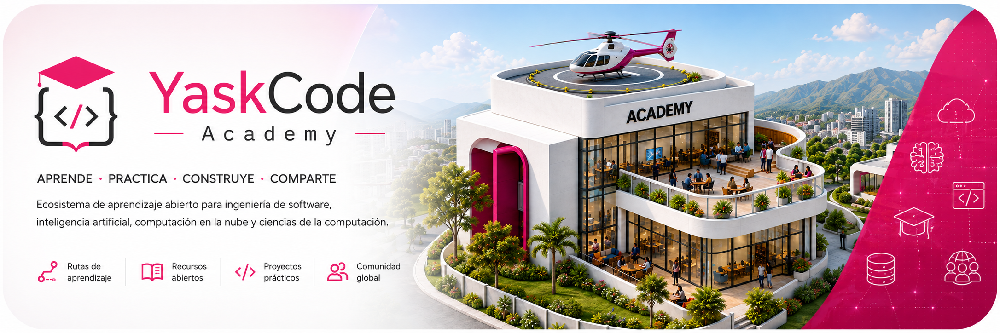
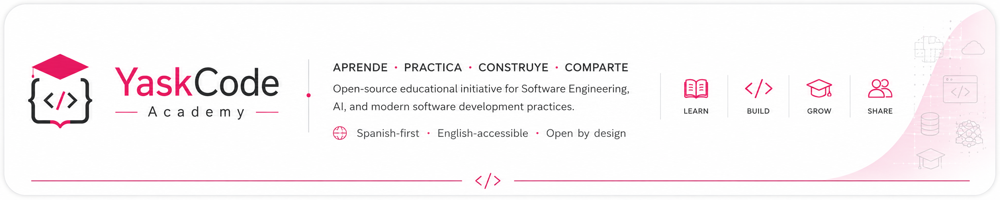

  

# YaskCode Academy

**YaskCode Academy** es una iniciativa educativa open source para la enseñanza de Ingeniería de Software, Inteligencia Artificial y prácticas modernas de desarrollo de software, dirigida especialmente a estudiantes, docentes y comunidades de habla hispana.

Nuestro modelo integra **aprendizaje activo, proyectos auténticos, workflows profesionales, automatización, estándares y evidencia del proceso de aprendizaje**, utilizando GitHub como parte del entorno educativo.

> **Aprender Ingeniería de Software haciendo Ingeniería de Software.**

---

## Nuestra misión

Formar profesionales capaces de **diseñar, construir, evaluar y evolucionar soluciones de software de calidad**, integrando fundamentos de computación, Ingeniería de Software, Inteligencia Artificial, datos y tecnologías cloud.

En YaskCode Academy, aprender programación también significa aprender a **colaborar, documentar, probar, revisar, automatizar y comunicar decisiones técnicas**.

El aprendizaje se desarrolla mediante experiencias progresivas en las que los conceptos se llevan a la práctica utilizando proyectos, laboratorios y herramientas profesionales.

---
## Modelo de aprendizaje YaskCode

YaskCode Academy integra principios consolidados de educación en computación con prácticas profesionales de Ingeniería de Software para crear experiencias de aprendizaje **activas, progresivas, basadas en proyectos y sustentadas en evidencia**.

### Nos inspiramos en

| Referencia                                            | Principios que incorporamos                                                                 |
| ----------------------------------------------------- | ------------------------------------------------------------------------------------------- |
| **CS50 y educación abierta en computación**           | Learning by doing, desafíos progresivos, práctica frecuente y recursos educativos abiertos. |
| **Aprendizaje activo**                                | Experimentar, construir, analizar resultados y reflexionar sobre las decisiones tomadas.    |
| **Project-Based Learning**                            | Aplicar conocimientos dentro de problemas y productos que evolucionan progresivamente.      |
| **GitHub Education y workflows profesionales**        | Control de versiones, colaboración, revisión, automatización y trazabilidad.                |
| **Ingeniería de Software y estándares profesionales** | Calidad, arquitectura, testing, seguridad, documentación, mantenimiento y mejora continua.  |

> Estas referencias inspiran el modelo, pero **YaskCode Academy desarrolla su propio enfoque educativo** y no representa una implementación ni afiliación oficial con estas iniciativas.

### El enfoque YaskCode

| Principio              | Aplicación                                                                                          |
| ---------------------- | --------------------------------------------------------------------------------------------------- |
| **GitHub-Native**      | El workflow profesional forma parte del entorno de aprendizaje.                                     |
| **Project-Based**      | Los conceptos se aplican mientras evolucionan soluciones reales.                                    |
| **Standards-Informed** | Las prácticas se relacionan progresivamente con estándares y buenas prácticas profesionales.        |
| **Evidence-Based**     | Issues, commits, pruebas, Pull Requests, revisiones y documentación producen evidencia del proceso. |
| **Iterative**          | Construir → revisar → corregir → validar → mejorar.                                                 |
| **Open by Design**     | El conocimiento puede documentarse, compartirse, reutilizarse y mejorarse colaborativamente.        |

---

## Cómo aprendemos

| 🎓 **Aprende**                                  | 🧪 **Practica**                                         | 🛠️ **Construye**                                        | 🌎 **Comparte**                                          |
| ----------------------------------------------- | ------------------------------------------------------- | -------------------------------------------------------- | -------------------------------------------------------- |
| Fundamentos, conceptos, arquitectura y métodos. | Ejercicios progresivos, laboratorios y experimentación. | Proyectos auténticos utilizando prácticas profesionales. | Documentación, reflexión, recursos abiertos y comunidad. |

El aprendizaje no termina cuando el código funciona. También implica comprender **por qué funciona, cómo fue construido, cómo puede verificarse y cómo puede evolucionar de manera responsable**.

---

## Ingeniería de Software como entorno de aprendizaje

En YaskCode Academy, GitHub no es solamente un lugar para almacenar código. Forma parte del entorno pedagógico en el que el estudiante aprende a trabajar mediante artefactos, decisiones y prácticas propias de la Ingeniería de Software.

**Problema → Requerimiento → Issue → Planificación → Branch → Implementación → Commit → Tests → Pull Request → Automated Checks → Engineering Review → Mejora → Merge → Documentación → Release → Reflexión**

Cada elemento tiene también una función educativa:

| Práctica            | Aprendizaje                                           |
| ------------------- | ----------------------------------------------------- |
| **Issue**           | Comprender y descomponer un problema.                 |
| **Branch**          | Aislar y organizar unidades de cambio.                |
| **Commit**          | Construir y documentar una solución incrementalmente. |
| **Tests**           | Verificar comportamiento y resultados.                |
| **Pull Request**    | Presentar y justificar una solución técnica.          |
| **GitHub Actions**  | Automatizar pruebas y controles.                      |
| **Code Review**     | Recibir y aplicar retroalimentación técnica.          |
| **Request changes** | Iterar sobre el trabajo antes de integrarlo.          |
| **Rulesets**        | Trabajar bajo restricciones y criterios de calidad.   |
| **Documentation**   | Comunicar decisiones y conocimiento técnico.          |
| **Release**         | Consolidar y comunicar una versión verificable.       |

> **La automatización puede validar el código. La revisión de ingeniería valida la solución.**

---

## Ingeniería por diseño

Las buenas prácticas no se reservan para el final de la formación. Se incorporan progresivamente desde el proceso de aprendizaje.

**Planificar**
Issues · backlog · prioridades · criterios de aceptación

**Construir**
Git · branches · commits · colaboración

**Validar**
Testing · coverage · quality checks · seguridad

**Revisar**
Pull Requests · feedback · revisión técnica

**Automatizar**
GitHub Actions · CI/CD · quality gates

**Documentar**
README · diagramas · ADRs · decisiones técnicas · evidencia

**Entregar**
Releases · versiones · despliegues · retrospectiva

---

## Aprendizaje informado por estándares

YaskCode Academy incorpora progresivamente cuerpos de conocimiento, estándares y buenas prácticas profesionales como referencias educativas.

| Área                             | Referencias                          |
| -------------------------------- | ------------------------------------ |
| **Ingeniería de Software**       | SWEBOK · ISO/IEC/IEEE 12207          |
| **Calidad de software**          | ISO/IEC 25010                        |
| **Testing**                      | ISO/IEC/IEEE 29119                   |
| **Seguridad**                    | OWASP · secure development practices |
| **Accesibilidad**                | WCAG                                 |
| **Arquitectura y documentación** | C4 Model · ADRs                      |
| **IA responsable**               | ISO/IEC 42001 · ISO/IEC 23894        |

> **Standards-informed education, not checkbox compliance.**

El propósito educativo es aprender a **conocer, interpretar y aplicar** estas referencias cuando sean pertinentes, sin presentar los proyectos estudiantiles como productos formalmente certificados.

---

## Rutas de aprendizaje

YaskCode Academy organiza progresivamente sus experiencias educativas alrededor de cinco áreas principales:

| Ruta                           | Enfoque                                                                    |
| ------------------------------ | -------------------------------------------------------------------------- |
| 💻 **Software Engineering**    | Arquitectura, diseño, testing, DevOps, calidad y evolución de software.    |
| 🤖 **Artificial Intelligence** | Sistemas inteligentes, RAG, agentes, sistemas multiagente e IA aplicada.   |
| 📊 **Data & Analytics**        | Datos, analítica, ciencia de datos y sistemas de información.              |
| ☁️ **Cloud Computing**         | Arquitecturas cloud-native, servicios gestionados, CI/CD y plataformas.    |
| 🧠 **Computer Science**        | Fundamentos, algoritmos, modelos computacionales y tecnologías emergentes. |

---

## Experiencias de aprendizaje actuales

YaskCode Academy se desarrolla a partir de experiencias universitarias reales que permiten validar y evolucionar progresivamente el modelo educativo.

### 💻 Ingeniería de Software y Bases de Datos

Experiencia integrada de Ingeniería de Software, arquitecturas modernas, bases de datos, cloud computing y desarrollo incremental de productos.

### 🤖 Sistemas Inteligentes

Experiencia orientada a Ingeniería del Conocimiento, sistemas RAG, agentes inteligentes, sistemas multiagente y orquestación, desarrollada mediante sprints técnicos y un proyecto integrador.

Estas experiencias funcionan como **laboratorios pedagógicos reales** para observar, documentar y mejorar progresivamente el modelo YaskCode.

---

## Open Education & Open Source

YaskCode Academy se construye con una estrategia **Spanish-first, English-accessible**.

🌎 **Spanish-first · English-accessible**
La documentación educativa principal se desarrolla en español, mientras que la misión, gobernanza, contribución y presentación del proyecto incorporarán progresivamente una capa internacional en inglés.

Nuestra estrategia de apertura diferencia entre:

* **Código y herramientas:** licencias open source estándar como MIT o Apache-2.0.
* **Materiales educativos:** licencias abiertas como CC BY 4.0 o CC BY-SA 4.0.

La apertura forma parte del diseño del proyecto: recursos, procesos y aprendizajes deben poder documentarse, reutilizarse y mejorarse responsablemente cuando su naturaleza lo permita.

---

## Colaboración abierta

YaskCode Academy está evolucionando desde experiencias docentes hacia una **iniciativa educativa open source con misión, gobernanza, recursos, contribuidores y comunidad propios**.

La infraestructura OSS incluirá progresivamente:

**CONTRIBUTING · GOVERNANCE · CODE OF CONDUCT · SECURITY · licenciamiento · onboarding · documentación bilingüe · evidencia pública de impacto**

Esto permitirá que docentes, estudiantes, profesionales y comunidades puedan comprender el proyecto y encontrar mecanismos claros para participar.

---

## Ecosistema YaskCode

YaskCode Academy forma parte de un ecosistema en el que cada espacio cumple una función diferente:

| Espacio                    | Propósito                                                          |
| -------------------------- | ------------------------------------------------------------------ |
| 🎓 **YaskCode Academy**    | Aprender fundamentos, métodos y prácticas.                         |
| 🧪 **YaskCode Laboratory** | Construir, experimentar, iterar y generar evidencia de ingeniería. |
| 🔬 **YaskCode Research**   | Investigar, analizar, validar y producir conocimiento científico.  |
| 📚 **YaskCode Library**    | Organizar y descubrir conocimiento y recursos.                     |
| 🌐 **YaskCode Community**  | Conectar, compartir y participar.                                  |

**Academy → Laboratory → Research**

**Aprender → Construir → Investigar**

---

  

